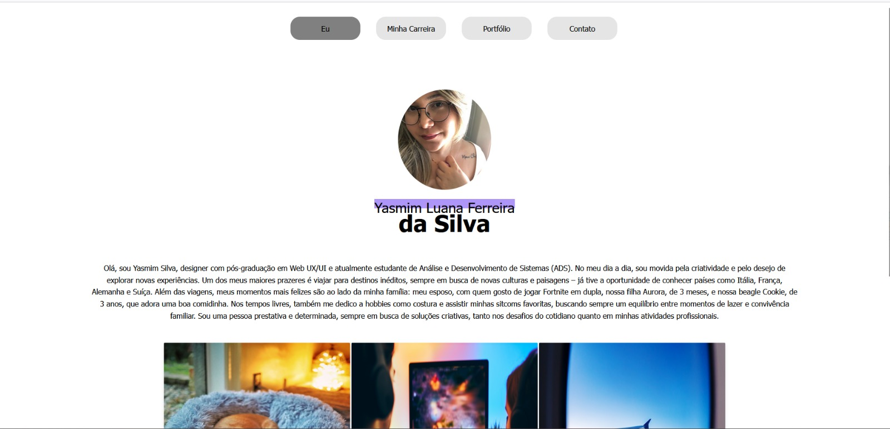
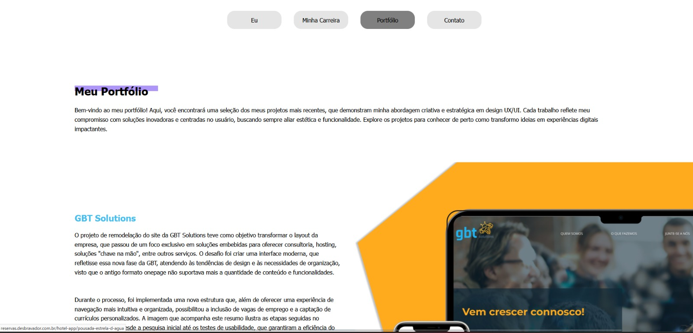
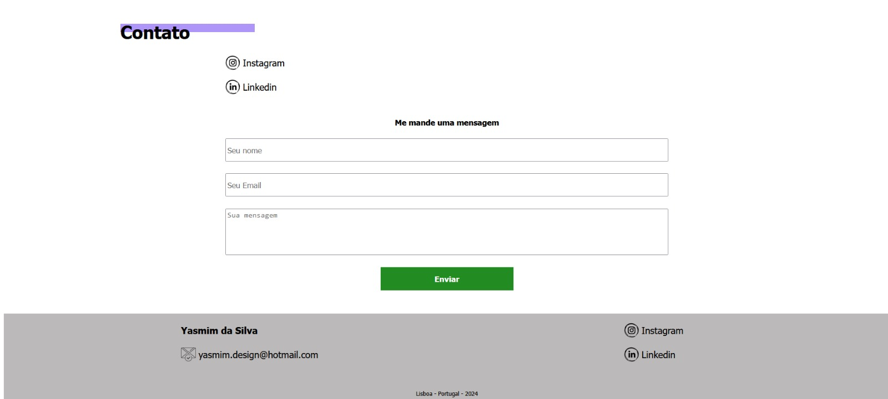

# 💼 Yasmim Silva – Web Portfolio

This is my personal web portfolio, originally created as part of my university coursework. The site showcases selected projects, design case studies, and development experiments I've worked on during my transition into tech and UX/UI design.

## 🌐 Live Version
> **[Visit the Portfolio](https://silvayasmim.github.io/)**  
> *(Hosted with GitHub Pages)*

---

## ✨ Features

- Responsive layout (desktop & mobile)
- Project showcase with custom cards
- Design-focused aesthetic based on clean, modern UI
- Lightweight and fast-loading

---

## 🛠️ Built With

- **HTML5**
- **CSS3**
- **JavaScript** (basic interactivity)
- **GitHub Pages** for hosting

---

## 📸 Screenshots


  
*Homepage layout with navigation*

  
*Portfolio project cards layout*

  
*Contact page layout*

---

## 🚀 How to Run Locally

```bash
# Clone the repository
git clone https://github.com/SilvaYasmim/SilvaYasmim.github.io.git

# Open the index.html file in your browser
cd SilvaYasmim.github.io
open index.html  # or just double-click the file

📈 Future Improvements

    Add language switch (PT/EN)

    Include case study pages for each project

    Integrate a contact form (via Formspree or Netlify)

    Add dark mode toggle

👩‍💻 Author

Yasmim Luana Ferreira da Silva
Lisbon, Portugal
GitHub | Email
